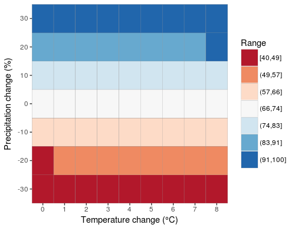
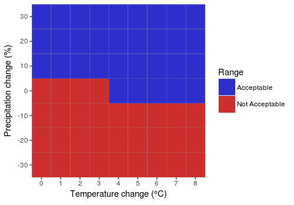

# wrviz - create visualizations for water resources

wrviz is a package meant to simplify the creation of core visualizations used by
the Hydrosystems Research Group at UMass Amherst. Currently, it enables the
rapid creation of climate response surfaces. Climate response surfaces are
created as ggplot2 objects, enabling further customization after the core plot
is made, or saving to a high resolution figure using
[ggsave](http://ggplot2.tidyverse.org/reference/ggsave.html).


```r 
df <- expand.grid(temp=0:8,precip=seq(0.7,1.3,by=0.1)) 
df$reliability <- seq(40,100,length=63) 
climate_heatmap_continuous(df,"reliability") 
```



```r 
climate_heatmap_binary(df,"reliability") 
```



## Get started

If you haven't yet, install devtools, then use it to install wrviz directly from
github.

```r 
install.packages("devtools") libray(devtools) 
devtools::install_github("tbadams45/wrviz") 
```

Start the Climate Response Creator addin by navigating to it in the addins menu
in RStudio, or directly at the console.

```r 
result <- wrviz:::climateResponseCreator()
ggplot2::ggsave("./myplot.pdf", result$plot, width = 5, height = 4.5, units = "in", dpi = 900)
```
